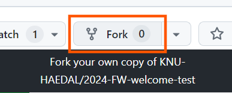
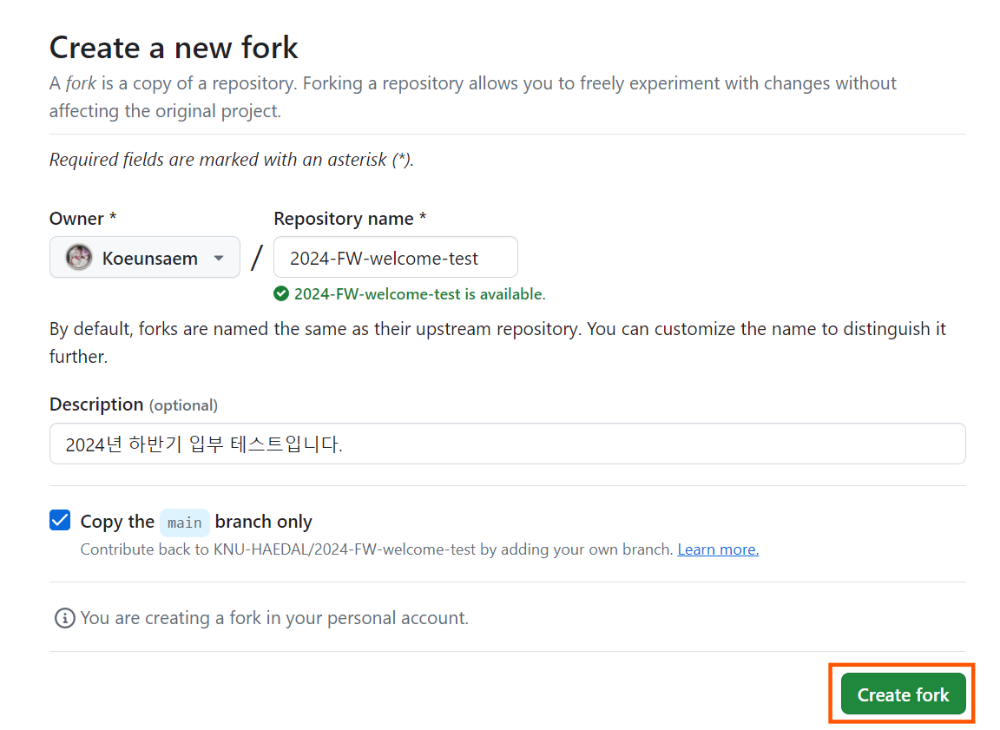
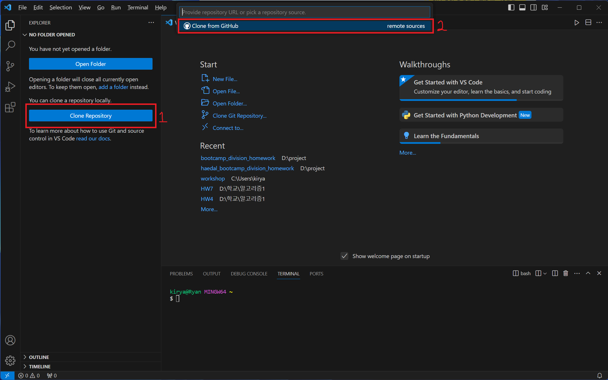
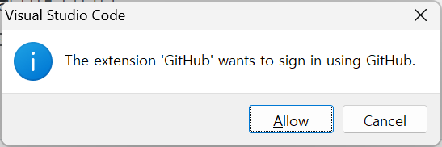
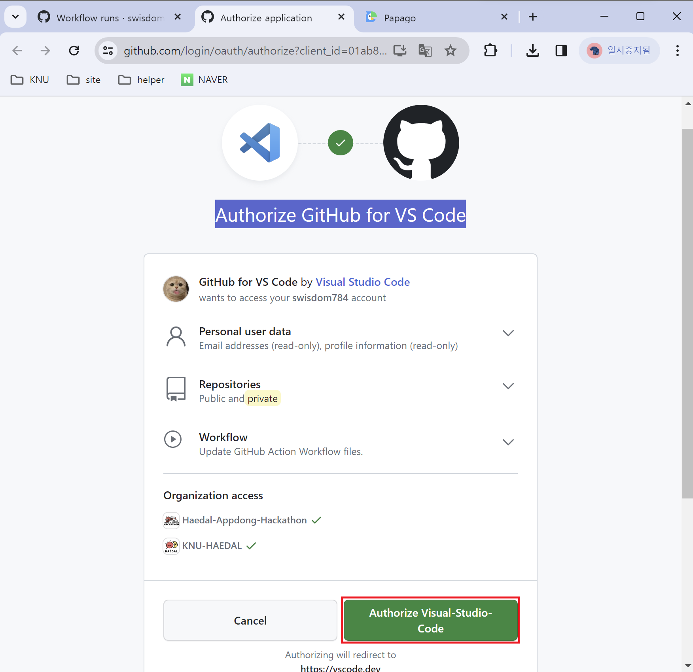
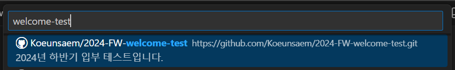
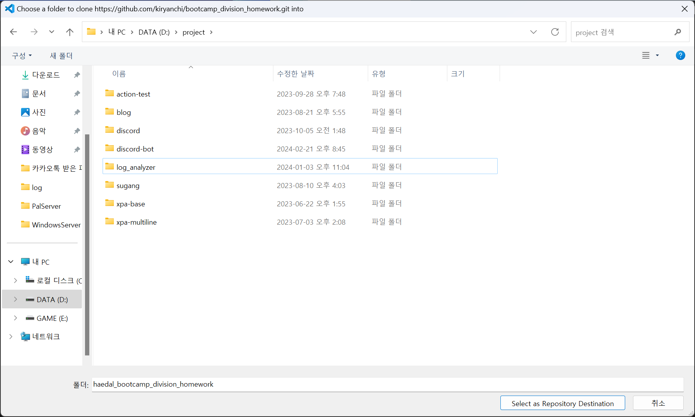
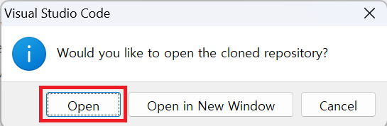
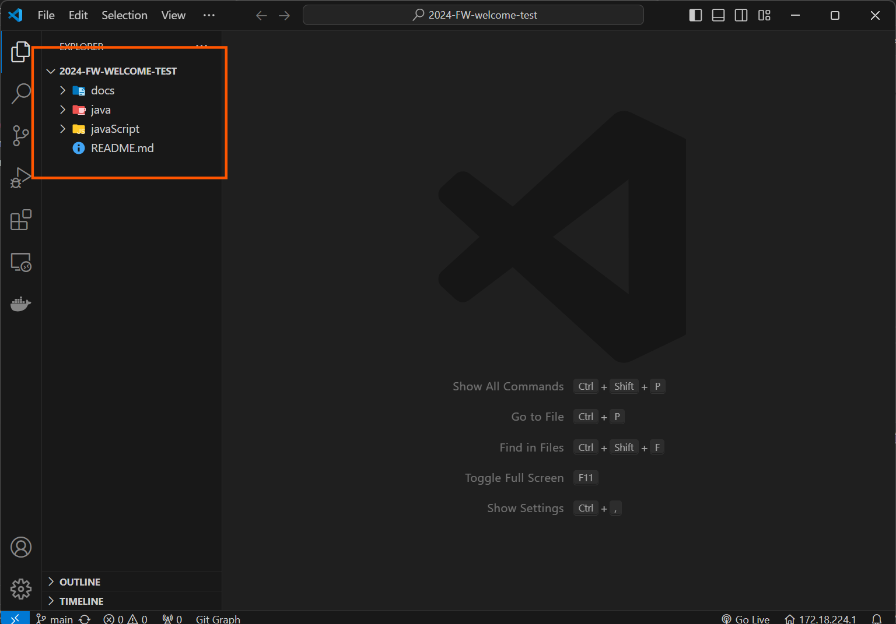
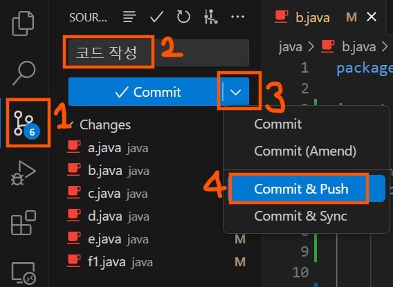

# 해달 입부테스트 git 가이드

해당 가이드는 Visual Studio Code의 `git graph` extension을 사용하고 있습니다.

git, Visual Studio Code(이하 VSC), VSC의 `git graph` extension을 설치하신 뒤 따라오시기 바랍니다.

google에 **VSC github 연동** 과 같은 키워드로 검색하시면 참고할 수 있는 웹페이지를 확인하실 수 있습니다.
[해당 링크](https://github.com/KNU-HAEDAL/bootcamp_division_homework/blob/main/docs/guide.md#3-git-%EC%84%A4%EC%B9%98)에서도 설치에 대한 자세한 설명이 있으니 참고하시기 바랍니다.

# 1. github Fork

1. `fork` 버튼을 클릭합니다.

   

1. `create fork` 버튼을 클릭합니다.

   

# 2. git clone

1. VSCode를 열면 `Clone Repository`를 클릭한 뒤 `Clone from GitHub`를 클릭합니다.

   

1. `Allow`를 클릭합니다.

   

1. `Authroize Visual-Studio-Code` 버튼을 클릭합니다.

   

1. fork한 `bootcamp_division_homework` repository를 선택합니다.

   

1. 원하는 경로로 clone합니다.

   

1. `Open` 버튼을 클릭합니다.

   

1. VSCode에 clone한 repository가 열립니다.

   

---

# 코드 작성 후 git push

1. `git graph` 탭을 클릭합니다.
1. commit message를 입력합니다.
1. 아래 화살표 버튼을 클릭한 뒤, `Commit & Push` 버튼을 클릭합니다.

   

1. `Yes`를 클릭합니다.

   

1. github에 업로드가 잘 되었는지 새로고침 하여 확인합니다.

   
